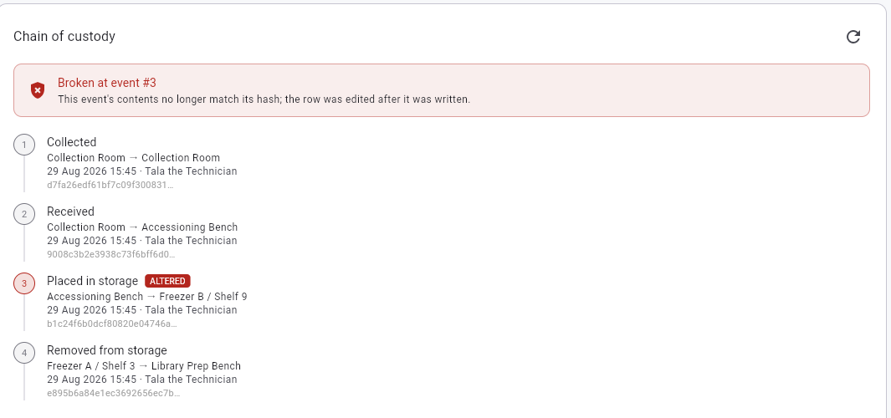

### Sirin Alkadi

**Software Engineer** · Riyadh, Saudi Arabia

Biochemist who went into code.
I build the API — and the app that talks to it.

---

## ⚡ Now

🔨 &nbsp;Backend services in **ASP.NET Core** — identity, authorization, events between services
📱 &nbsp;Still writing **Flutter**, because I like building the part people actually touch
🧪 &nbsp;Weekend project: making an audit trail that survives someone with database access

---

## 🛠 Built

**🧬 [GenomeTrack](https://github.com/SirinK2/GenomeTrack)** — lab custody that can't be faked
 Someone edited a record straight in the database. The system named the row.

`.NET 9` `PostgreSQL` `EF Core` `Docker` `Flutter`

 

**📱 Flutter — three years, mostly private repos**
 The shared core and auth module every app in a monorepo runs on · a component library the
team adopted as its default · client apps from design handoff to store release · real-time over
Socket.IO, Firebase, BLE beacons

Public bits: [image_filter](https://github.com/SirinK2/image_filter) · [color_filter](https://github.com/SirinK2/color_filter) — bitwise play with bitmaps and colour channels

---

## 🧰 Stack

---

<picture>
  <source media="(prefers-color-scheme: dark)" srcset="https://raw.githubusercontent.com/SirinK2/SirinK2/output/snake-dark.svg">
  
</picture>

🐍 eating a year of commits, regenerated nightly

---

