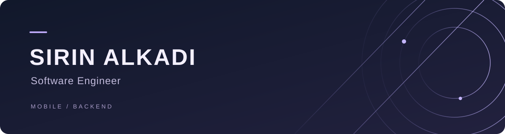

 

### A little about me

I work with **Flutter** and explore backend development with **ASP.NET Core**.

I enjoy building apps and the shared components behind them. Most of my work lives in private repositories; here I share smaller projects and things I’m learning.

 

### What I work with

 

### Around my GitHub

A couple of public repositories to explore.

[image_filter ↗](https://github.com/SirinK2/image_filter) · [color_filter ↗](https://github.com/SirinK2/color_filter)

 

---

### Let’s connect

